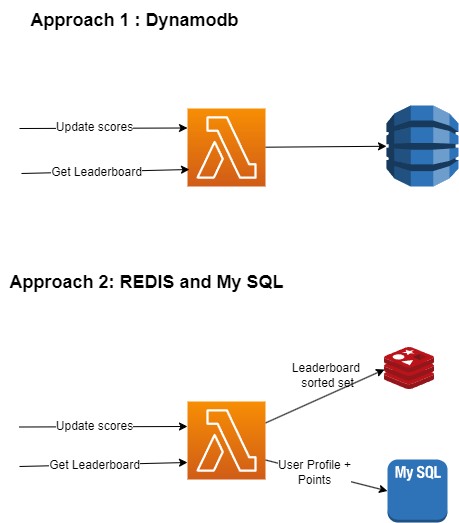

# Leader Board

## Description
Simulate a leader board for a game. The leader board is a list of players sorted in descending order by score.

## Implementation

Demo application design is based on the book System Design Interview, Part 2



### Approach 1 : Dynamo DB

#### Lambda Function
- Lambda function is WebAPI which exposes endpoints to store scores and get leader board
- Lambda function connects to DynamoDB to store and retrieve data

#### DynamoDB
- DynamoDB has Leaderboard_Name as partition key and Score as sort key
- DynamoDb is queried and updated using Low Level API


#### Localstack
- Localstack is a docker container which simulates AWS services locally
- To run localstack, run the following command from the root directory
- Setups for localstack are in localstack.yml file
- It's got some specific settings for running lambdas and exposing ports

```powershell
docker-compose -f localstack.yml up -d
```

#### Deployment
- Lambda function and Dynamodb are deployed using Terraform scripts into localstack container
- To deploy, run the following command from the root directory
- Setups for terraform are in main.tf file

```powershell

dotnet publish .\App\src\LeaderBoard\ -c Release -r linux-x64

terraform init

terraform plan

terraform apply --auto-approve

```
- once deployed, you can test the endpoints using LeaderboardTests.http file
- Just replace the http://localhost:5000 with the lambda endpoint url from the output of terraform apply command

### Approach 2 : Elasticache(TODO)
